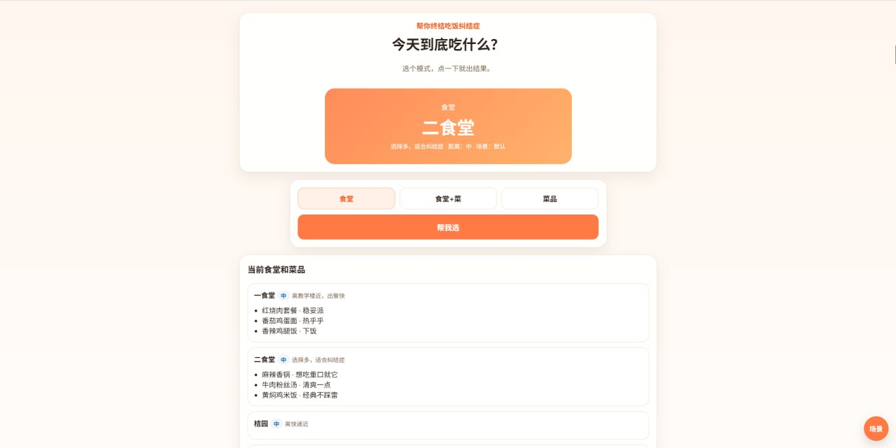

# today-what-to-eat

一个手机优先的“今天吃什么”小网站，用来解决选择困难症。

适合宿舍、办公室、校园食堂、常吃外卖店等场景。

## 项目截图

<p align="center">
  
</p>

## 功能特性

- 手机优先的简洁 UI
- 随机食堂
- 随机食堂 + 菜品
- 全局随机菜品
- 后台管理食堂和菜品
- 食堂/菜品权重控制
- 食堂距离等级（近 / 中 / 远）
- 场景偏好加权
  - 默认
  - 下雨天
  - 不想走远
- 前台可配置是否显示权重
- 顶部文案支持后台单独编辑与开关
- 后台支持概率预览页
- 后台支持理论概率扇形图 / 进度条可视化
- 后台编辑区支持异步保存 / 删除
- SQLite 持久化
- 支持 Docker / Docker Compose 部署

---

## 页面说明

### 前台

前台主要用于快速抽取“今天吃什么”：

- **食堂**：按食堂权重随机
- **食堂+菜**：先选食堂，再在该食堂里抽菜
- **菜品**：跨所有食堂直接抽一道菜

#### 场景偏好

页面右下角有一个悬浮按钮 `场景`，可以切换：

- 默认
- 下雨天
- 不想走远

场景会参与随机时的权重计算。

### 后台

后台地址：`/admin`

可管理：

- 食堂名称
- 食堂描述
- 食堂距离等级
- 食堂权重
- 菜品名称
- 菜品备注
- 菜品权重
- 前台文案显示设置
- 前台是否显示权重
- 概率预览

#### 概率预览

后台提供 `/admin/probabilities` 页面，可查看：

- 默认 / 下雨天 / 不想走远 三种场景下的理论抽中概率
- 各食堂最终权重计算结果
- 进度条可视化
- 扇形图可视化

---

## 技术栈

- **FastAPI**：Web 框架
- **Jinja2**：服务端模板渲染
- **SQLAlchemy**：ORM
- **SQLite**：默认数据库
- **纯 CSS**：移动端响应式界面
- **Docker / Docker Compose**：部署

---

## 权重逻辑

### 基础权重

每个食堂和菜品都有基础权重，范围：

- `1 ~ 20`

权重越高，越容易被抽中。

### 场景偏好逻辑

当前实现采用：

**最终权重 = 原始权重 × 场景系数**

#### 默认

- 近：`× 1.0`
- 中：`× 1.0`
- 远：`× 1.0`

#### 下雨天

- 近：`× 1.8`
- 中：`× 1.2`
- 远：`× 0.6`

#### 不想走远

- 近：`× 2.2`
- 中：`× 1.1`
- 远：`× 0.45`

### 三种抽取模式的计算方式

#### 1. 食堂

直接按：

`食堂权重 × 场景系数`

#### 2. 食堂 + 菜品

分两步：

- 先抽食堂：`食堂权重 × 场景系数`
- 再在该食堂内按菜品自身权重抽菜

也就是说，场景主要影响“去哪家”，不额外二次影响该食堂内部菜品的排序。

#### 3. 菜品

按：

`菜品权重 × 所属食堂的场景系数`

---

## 本地开发启动

```bash
cd today-what-to-eat
python3 -m venv .venv
source .venv/bin/activate
pip install -r requirements.txt
export ADMIN_PASSWORD=123456
export SECRET_KEY=$(python3 - <<'PY'
import secrets
print(secrets.token_hex(32))
PY
)
uvicorn app.main:app --reload --host 0.0.0.0 --port 8000
```

访问：

- 前台：`http://localhost:8000`
- 后台：`http://localhost:8000/admin`

---

## Docker 部署

### 方式一：Docker Compose（推荐）

```bash
git clone <your-repo-url>
cd today-what-to-eat
cp .env.example .env
```

编辑 `.env`：

```env
ADMIN_PASSWORD=please-change-me
SECRET_KEY=replace-with-a-long-random-string
```

启动：

```bash
docker compose up -d --build
```

查看状态：

```bash
docker compose ps
```

查看日志：

```bash
docker compose logs -f
```

停止：

```bash
docker compose down
```

### 后续更新

如果仓库有新提交，进入项目目录后执行：

```bash
git pull
docker compose up -d --build
```

一条命令也可以：

```bash
git pull && docker compose up -d --build
```

更新后建议检查：

```bash
docker compose ps
docker compose logs --tail=100
```

如果 `git pull` 提示有本地改动，可以先查看：

```bash
git status
```

如果你确认要以 GitHub 最新版本为准，可以强制同步：

```bash
git fetch origin
git reset --hard origin/main
docker compose up -d --build
```

> 注意：`git reset --hard origin/main` 会丢弃服务器上的本地改动。

访问：

- 前台：`http://服务器IP:8000`
- 后台：`http://服务器IP:8000/admin`

### 方式二：原生 Docker

构建镜像：

```bash
docker build -t today-what-to-eat .
```

运行容器：

```bash
docker run -d \
  --name today-what-to-eat \
  -p 8000:8000 \
  -e ADMIN_PASSWORD=123456 \
  -e SECRET_KEY=replace-me \
  -e DATABASE_URL=sqlite:////app/data/data.db \
  -v $(pwd)/data:/app/data \
  --restart unless-stopped \
  today-what-to-eat
```

---

## 环境变量

| 变量名 | 说明 | 默认值 |
|---|---|---|
| `ADMIN_PASSWORD` | 后台登录密码 | `admin123` |
| `SECRET_KEY` | Cookie 签名密钥 | `change-me-secret` |
| `DATABASE_URL` | 数据库连接串 | `sqlite:///data.db` |

> 生产环境请务必修改 `ADMIN_PASSWORD` 和 `SECRET_KEY`。

---

## 后台使用说明

### 食堂字段

- **食堂名称**：必填
- **描述**：可留空
- **距离等级**：近 / 中 / 远
- **权重**：1~20

### 菜品字段

- **菜品名称**：必填
- **备注**：可留空
- **所属食堂**：必选
- **权重**：1~20

### 前台显示设置

支持：

- 是否显示权重
- 顶部第 1 句文案显示/隐藏与编辑
- 顶部第 2 句文案显示/隐藏与编辑
- 顶部第 3 句文案显示/隐藏与编辑

### 后台交互体验

当前后台编辑区支持：

- 行内异步保存
- 行内异步删除
- 删除与保存同一行展示
- 避免每次编辑后整页跳回顶部

---

## 默认数据

首次启动会自动写入示例数据，方便你快速测试。

如果你想使用自己的真实食堂和菜品数据，可以登录后台直接修改。

---

## 项目结构

```text
today-what-to-eat/
├── app/
│   ├── main.py
│   ├── static/
│   │   └── style.css
│   └── templates/
│       ├── admin.html
│       ├── admin_probabilities.html
│       ├── base.html
│       ├── index.html
│       └── login.html
├── .env.example
├── docker-compose.yml
├── Dockerfile
├── README.md
└── requirements.txt
```

---

## 后续可扩展方向

- 增加“很赶时间”场景
- 支持标签系统（辣 / 清淡 / 面食 / 米饭）
- 支持黑名单（今天不想吃这个）
- 支持按星期几做偏好加权
- 支持多用户或多人共享使用
- 支持 PostgreSQL

---

## License

MIT
